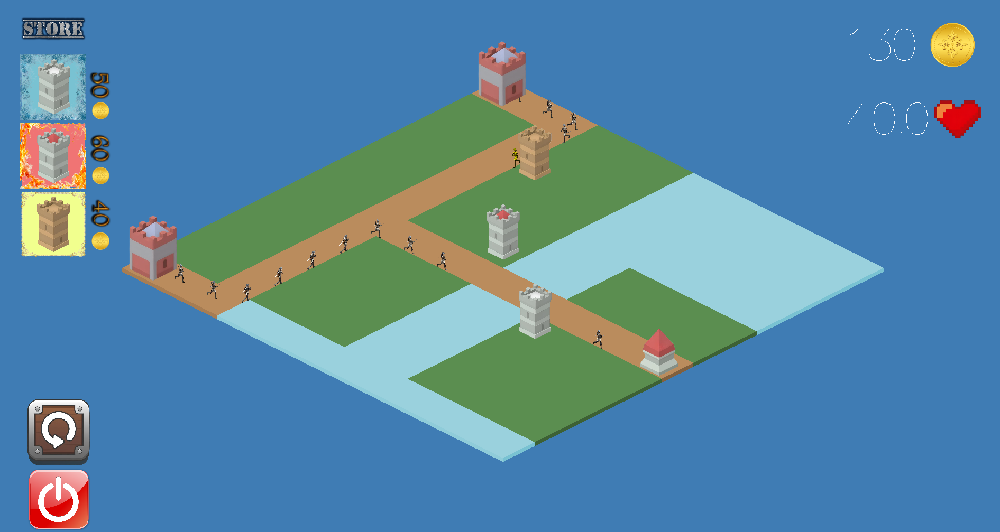

<div align="center">

# 🏰 Immutable Towers

A **tower defense game** developed in **Haskell** using functional programming principles.


</div>

## 🎮 About the Project

**Immutable Towers** is a **tower defense game** developed in **Haskell**, a purely functional programming language.

The player must strategically place towers to defend their base from incoming enemies. Enemies follow a predefined path towards the base, and the objective is to prevent them from reaching their destination.

The game features a graphical interface developed using the **Gloss** library.

## 📷 Demo

<div align="center">
  
</div>

## 🕹️ Gameplay

The main objective is to protect the base by strategically placing towers along the enemy's path.

* 🏰 **Place towers** to defend your base.
* 👾 **Enemies** follow a predefined path towards the base.
* 🎯 **Attack enemies** before they reach the end of the path.
* ❤️ **Protect the base** from incoming enemies.
* 🧠 **Use strategy** to determine the best positions for your towers.

## 🛠️ Technologies

* 🟣 **Haskell** — Functional programming language used to develop the game.
* 📦 **Cabal** — Build system and package management.
* 🎨 **Gloss** — Graphics and game interface.
* 🧪 **HUnit** — Unit testing framework.
* 📚 **Haddock** — Automatic documentation generation.
* 🔍 **Doctest** — Testing examples included in the documentation.

## ⚙️ Build & Run

The project uses **Cabal** to build and run the game.

### ▶️ Run the Game

```bash
cabal run --verbose=0
```

### 🧑‍💻 Open the Haskell Interpreter

To open **GHCi** with the project loaded, use:

```bash
cabal repl
```

## 🧪 Testing

The project uses **HUnit** for unit testing.

### Run Unit Tests

```bash
cabal test
```

To generate a test coverage report, use:

```bash
cabal test --enable-coverage
```

### 🔍 Run Doctests

Examples included in the documentation can also be executed as tests using **Doctest**.

If Doctest is not installed, it can be installed with:

```bash
cabal install doctest
```

Then run the documentation examples with:

```bash
cabal repl --build-depends=QuickCheck,doctest --with-ghc=doctest --verbose=0
```

## 📚 Documentation

Project documentation can be generated using **Haddock**:

```bash
cabal haddock
```

The generated documentation provides information about the project's modules, functions, and types.

## 📁 Project Structure

```text
projeto/
├── app/
│   └── imagemPreview/
│       └── game.png       # Gameplay preview
├── lib/                   # Library and game logic
├── test/                  # Unit tests
└── immutable-towers.cabal # Cabal project configuration
```

## 🎯 Project Goals

This project was developed as an opportunity to apply **functional programming concepts** in Haskell while building an interactive game.

The main goals include:

* 🧩 Applying functional programming principles.
* 🏰 Developing a functional tower defense game.
* 🎨 Creating a graphical interface using Gloss.
* 🧪 Implementing automated unit tests with HUnit.
* 📚 Providing automatically generated project documentation.
* 📦 Managing the project and its dependencies with Cabal.

---